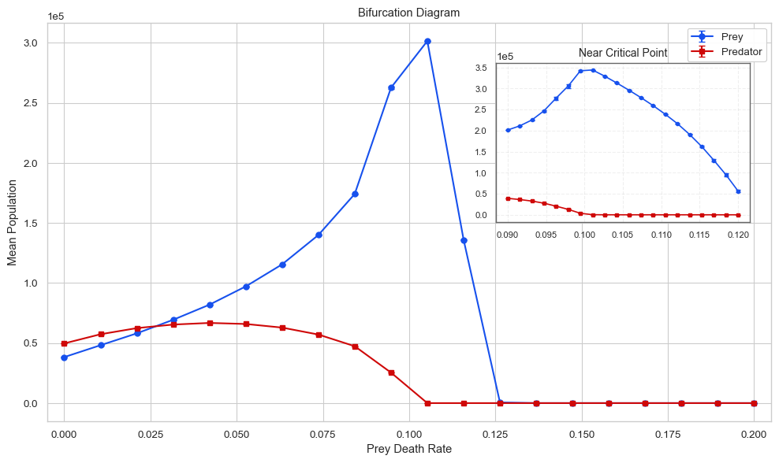
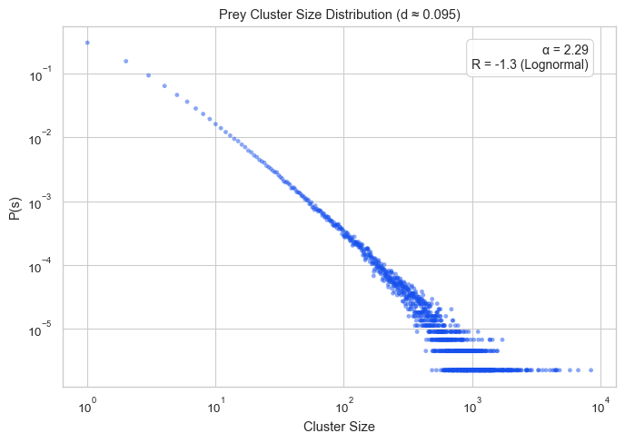
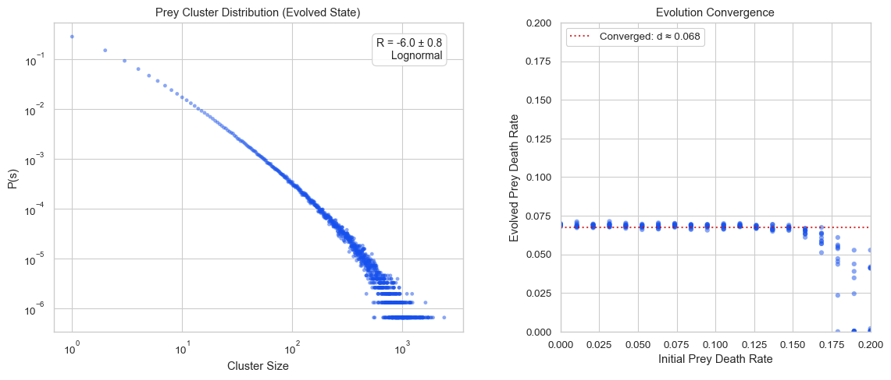
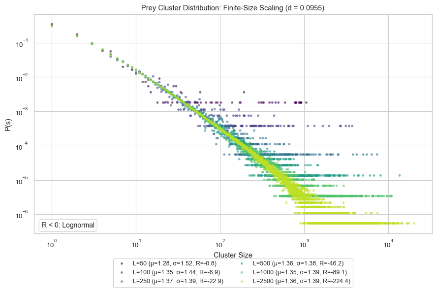
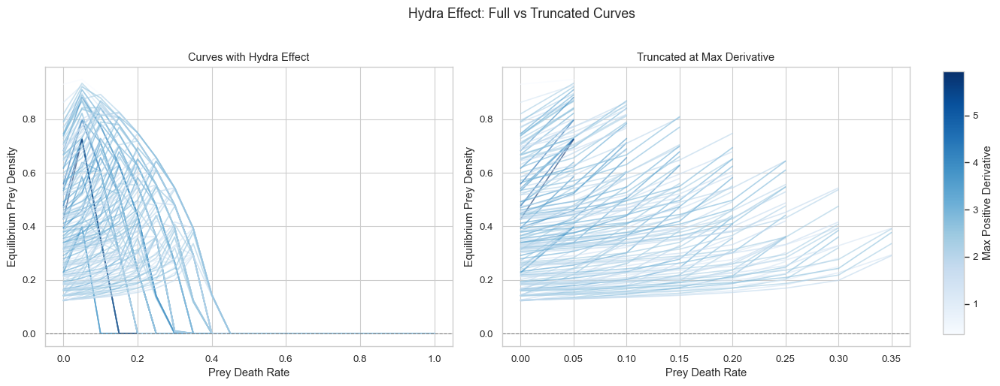
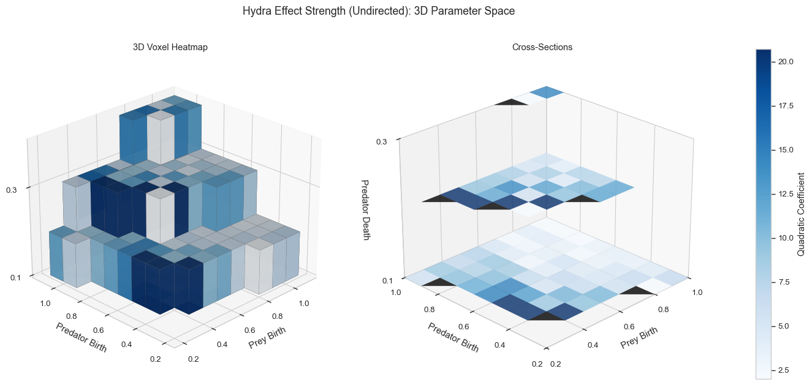
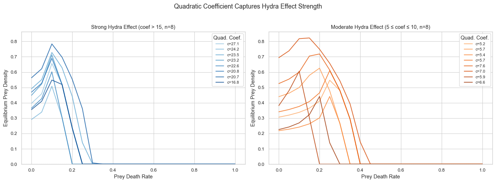
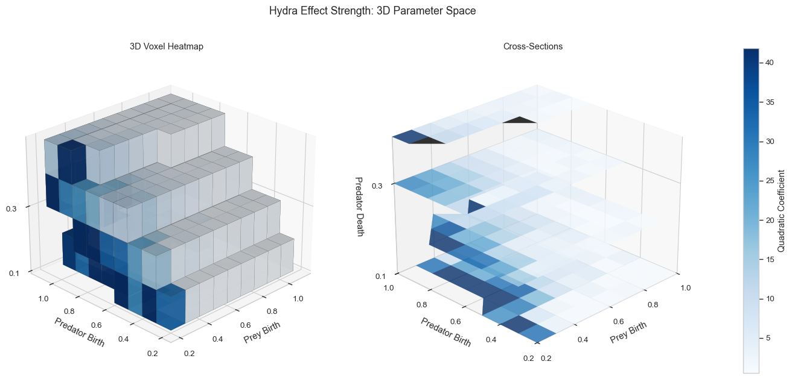
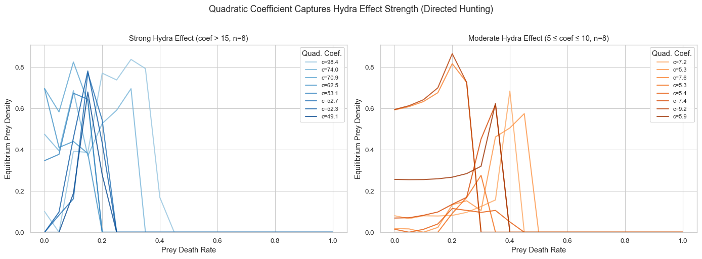

## Experimental Results

This document summarizes the key findings from the predator-prey cellular automaton experiments exploring the Hydra effect and self-organized criticality.

#### Phase 1: Critical Point Identification

Locate the critical prey mortality rate where the population dynamics undergo a qualitative transition and test whether the system exhibits signatures of self-organized criticality at this point.

We performed a parameter sweep over ```prey_death_rate``` $\in [0, 0.2]$ while holding other parameters fixed.

```
prey_birth_rate = 0.2
predator_birth_rate = 0.8
predator_death_rate = 0.05
grid_size = 1000

```
Each simulation ran for 1000 warmup steps followed by 1000 measurement steps. The mean populations and cluster statiustics were recorded on the final grid states.



The bifurication diagrams reveals a clear Hydra effect; increasing prey mortality leads to increasing prey population.

**Observations**

- **Low mortality regime** ($d_1 < 0.03$): Both species coexist at moderate densities. Predators suppress prey populations through sustained predation pressure.

- **Hydra effect regime** ($0.03 < d_1 < 0.095$): Prey populations *increase* with mortality: elevated prey death disrupts predator populations .

- **Peak prey abundance** ($d_1 \approx 0.095$): Prey populations reach maximum (~300,000 individuals on a $10^6$ cell grid)

- **Post-critical regime** ($d_1 > 0.10$): Predators go extinct. Prey populations decline monotonically with further mortality increases, following standard ecological expectations.

- **Prey extinction threshold** ($d_1 > 0.12$): Beyond this point, prey mortality exceeds reproduction capacity and the population crashes.


The prey cluster size distributions were analyzed at the transition point to test for SOC. SOC theory predicts a power law distribution.



The log-log plot shows the probability distribution of prey cluster sizes at the critical point. Visual inspection suggests approximate power law scaling with $$\alpha \approx 2.29$$. 

We used the `powelaw` Python library to test whetehr the cluster size distribution follows a true power law. This library implements the following:

1. **Maximum likelihood estimation** of the power-law exponent $\alpha$
2. **Automatic detection** of the lower bound $x_{min}$ where power-law behavior begins
3. **Likelihood ratio tests** comparing power-law against alternative distributions

The key test compares the power-law fit against a lognormal distribution, which is the most common false positive for power-law claims. The test statistic $R$ is the log-likelihood ratio:

$$R = \mathcal{L}_{\text{power-law}} - \mathcal{L}_{\text{lognormal}}$$

where:
- $R > 0$: Power-law is a better fit
- $R < 0$: Lognormal is a better fit
- $|R| < 1$: Inconclusive (fits are comparable)


Our results showed $\alpha = 2.29$ and $R = -1.3$. The negative $R$ value indicates that a lognormal distribution provides a better fit to the cluster size data than a power-law. This is evidence against true self-organized criticality. This might suggest that the system is near critical but not at a true critical point.


#### Phase 2: Evolutionary SOC Analsyis


Test whether predator-prey system exhibits SOC by allowing prey mortality rates to evolve. Under the SOC hypothesis, evolution should drive the system toward the transition point identified in Phase 1.

We enabled per-cell evolution of the prey death parameter. Each prey individual carries its own ```prey_death_rate``` value. The offsprings inherit their parents value with Gaussian mutation. Evolution occurs during the warmup steps, then frozen for the measurement.



**Right panel**: The evolved prey death rate as a function of initial prey death rate.

The results showed unexpected convergence behavior:

1. **Universal attractor at $ \approx 0.068$**: Regardless of initial conditions (from $d_1 = 0$ to $d_1 \approx 0.15$), the population evolves toward the same equilibrium mortality rate.

2. **Basin of attraction**: Initial values spanning nearly the entire viable range converge to the same point, indicating a strong evolutionary attractor.

3. **Extinction regime** ($d_1 > 0.15$): When initialized above this threshold, populations either go extinct or show highly variable outcomes (scatter toward $d_1 = 0$), likely representing surviving remnant populations after near-extinction events.

**Left panel**: Prey cluster size distribution at the evolved equilibrium ($d_1 \approx 0.068$).

The negative $R$ value is even more extreme than at the Phase 1 critical point ($R = -1.3$), indicating the evolved state is **further from criticality**, not closer.

These results represent a significant puzzle. The system appears to self-organize. However, this convergence does not take place toward the transition point. At the moment, we do not have a definitive explanation for this behavior. A possible explanation could relate to evolution optimizing for individual fitness, not population level-properties like criticality.


#### Phase 3: Finite-size Scaling 

Investigate whethr the near-critical behavior observed in Phase 1 is a finite-size artifact. If the system is critical, scaling analysis across different system sizes should reveal universal behavior. If not, larger system should show stronger deviation from power-law scaling.

We ran simulation at the critical point ($d_1 = 0.0955$) across six grid sizes $L \in \{50, 100, 250, 500, 1000, 2500\}$ with fixed parameters: 

```
prey_birth_rate = 0.2
predator_birth_rate = 0.8
predator_death_rate = 0.05 
```

For each system size, we aggregated all prey cluster sizes across replicates, fitted a lognormal distrbution using the maximum likelihood estimation, and computed power-law vs. lognormal likelihood ratio $R$.

---

#### NOTE: Lognormal Distribution

The lognormal distribution describes a variable whose logarith is normally distributed:

$$P(s) = \frac{1}{s \sigma \sqrt{2\pi}} \exp\left(-\frac{(\ln s - \mu)^2}{2\sigma^2}\right)$$

where:
- $\mu$ = mean of $\ln(s)$ (log-scale location)
- $\sigma$ = standard deviation of $\ln(s)$ (log-scale spread)

The lognormal parameters were fitted using `scipy.stats.lognorm.fit()` with location fixed at zero.

---



The figure shows prey cluster size distributions at the critical point across all system sizes with lognormal fit parameters and likelihood ratios.

**Observations:**

**1. Lognormal parameters are stable across system sizes**

The fitted $\mu$ and $\sigma$ values converge to approximately $\mu \approx 1.36$ and $\sigma \approx 1.39$ for $L \geq 250$. This consistency indicates that the lognormal form is a robust description of the cluster size distribution, not a finite-size artifact.


**2. Evidence against power-law grows with system size**

This is the crucial result: as $L$ increases, $R$ becomes *more negative*, not less:

$$R: -0.8 \rightarrow -6.9 \rightarrow -22.9 \rightarrow -46.2 \rightarrow -89.1 \rightarrow -224.4$$

If the system were truly critical with finite-size scaling corrections, we would expect $R \rightarrow 0$ as $L \rightarrow \infty$.

**3. Distributions do not collapse**

At a true critical point, rescaling cluster sizes by $L^{d_f}$ (where $d_f$ is the fractal dimension) should collapse all distributions onto a universal scaling function. The cluster size distribution is lognormal, which becomes more apparent with increasing system size. This result suggests that the underlying process involves multiplicative growth rather than the scale free branching processes that generate power laws.


#### Phase 4 & 5: Sensitivity Analysis and Directed Hunting

We map the hydra effect across the full 4D parameter space to understand the conditions under which the Hydra effect occurs, the strength of the effect across different parameter regimes, and whether directed hunting alters the effect.

Phase 4 uses random neighbor selection while Phase 6 uses directed hunting where predators preferentially target prey neighbors.

We performed as sweep across the following model parameters:

```
prey_birth
prey_death
predator_birth
predator_death

```

For each parameter combination, we computed the equilibrium prey density curve and detected the Hydra effect by checking fro regions with a positive derivative:

$$\frac{d(\text{prey density})}{d(\text{prey death})} > 0$$

A curve exhibits the Hydra effect is prey density increases with mortality over any portion of the ```prey_death``` range.

To measure the stength of the Hydra effect, we fitted a qudratic function to the rising portion of each curve (truncated at the max derivative point):

$$\rho(d_1) = a \cdot d_1^2 + b \cdot d_1 + c$$

The quadratic coefficient $a$ captures how sharply the prey density rises and falls. Larger $|a|$ indicates a more pronounced Hydra effect with sharper peak. This apporach filters to only the Hydra effect portion, captures curvature, and provides a single scalar metric for comparison across parameter space.

#### Results: Undirected Hunting (Phase 4)



**Left panel**: All parameter combinations exhibiting the Hydra effect.
**Right panel**: Curves truncated at the maximum derivative point, isolating the rising (Hydra) portion. Color indicates the maximum positive derivative—darker blue corresponds to steeper initial increases.



The 3D voxel plots show Hydra effect strength (quadratic coefficient) across the parameter space.



**Left panel (Strong Hydra, coef > 15)**: Sharp, pronounced peaks with prey density increasing from ~0.3–0.6 to ~0.7–0.8 before collapsing.
**Right panel (Moderate Hydra, coef 5–10)**: Gentler curves with broader peaks. The Hydra effect is present but less dramatic.

#### Results: Directed Hunting (Phase 6)



The same analysis with directed hunting enabled reveals a dramatically different pattern.

**Observations:**

1. **Much stronger Hydra effect**: Maximum quadratic coefficients reach ~40–50, roughly **double** the undirected case

2. **Shifted parameter region**: The strong-effect region extends to higher predator birth rates and shows a different structure

3. **More concentrated**: The effect is stronger where it occurs but may be more restricted in parameter space



**Left panel (Strong Hydra, coef > 15)**: Extremely sharp peaks with quadratic coefficients reaching 49–98. However, the curves are notably noisier than the undirected case, with irregular trajectories.
**Right panel (Moderate Hydra, coef 5–10)**: More variable behavior compared to undirected hunting. Some curves show multiple peaks or irregular shapes.

The results indicate that directed hunting amplifies the Hydra effect but also introduces instability. Smarter predators paradoxically create conditions for stronger Hydra effects. 


